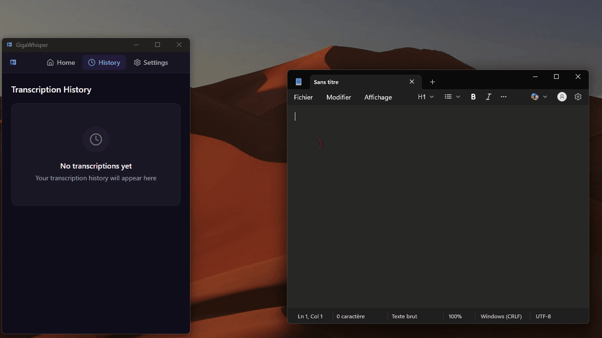

<div align="center">

# GigaWhisper

**Type with your voice in any Windows app — free, open-source, privacy-first.**

[](https://github.com/karvrak/gigaWhisper/stargazers)
[](LICENSE)
[](https://github.com/karvrak/gigaWhisper/releases/latest)
[](https://github.com/karvrak/gigaWhisper/releases)
[](https://github.com/karvrak/gigaWhisper/actions/workflows/ci.yml)
[](https://codecov.io/gh/karvrak/gigaWhisper)

<br/>

<!-- Replace with your actual demo GIF or video -->
<!-- To record: use OBS or ScreenToGif, export as .gif, upload to repo or imgur -->


<br/>

*Press a hotkey, speak, and your words appear instantly — in Word, Chrome, VS Code, Slack, anywhere.*

[**Download**](https://github.com/karvrak/gigaWhisper/releases/latest) · [**Documentation**](docs/ARCHITECTURE.md) · [**Report Bug**](https://github.com/karvrak/gigaWhisper/issues) · [**Request Feature**](https://github.com/karvrak/gigaWhisper/issues)

</div>

---

## Why GigaWhisper?

<table>
<tr>
<td width="50%">

### 🔒 Privacy First
Run 100% offline with local Whisper models. Your voice never leaves your machine.

### ⚡ Lightning Fast
GPU-accelerated transcription via Vulkan or CUDA. Cloud options (Groq, Deepgram, OpenAI) for near-instant results.

### 🎯 Works Everywhere
Auto-pastes into any active window — Word, Chrome, VS Code, Slack, Discord, terminal, you name it.

</td>
<td width="50%">

### 💸 Free & Open Source
No subscriptions, no usage limits, no telemetry. MIT licensed forever.

### 🎙️ Flexible Recording
Push-to-Talk or Toggle mode. Configurable hotkeys including mouse buttons (Mouse4/Mouse5).

### 🧠 Smart Processing
Voice Activity Detection filters silence. Choose from Tiny to Large whisper models based on your hardware.

</td>
</tr>
</table>

---

## GigaWhisper vs Alternatives

| Feature | **GigaWhisper** | SuperWhisper | Dragon | Wispr Flow |
|---|:---:|:---:|:---:|:---:|
| **Price** | **Free** | $8-16/mo | $500+ | $8/mo |
| **Open Source** | **Yes (MIT)** | No | No | No |
| **Offline Mode** | **Yes** | Yes | Yes | No |
| **Cloud Transcription** | **Yes (4 providers)** | Limited | No | Yes |
| **GPU Acceleration** | **Vulkan + CUDA** | Metal | — | — |
| **Windows Support** | **Yes** | macOS only | Yes | macOS only |
| **Auto-Paste** | **Yes** | Yes | Yes | Yes |
| **Push-to-Talk + Toggle** | **Both** | Both | Push only | Toggle only |
| **Mouse Button Shortcuts** | **Yes** | No | No | No |
| **Custom Hotkeys** | **Full** | Limited | Limited | Limited |
| **Transcription History** | **Yes** | No | Yes | No |

---

## Installation

### Quick Install (recommended)

1. Download the latest `.msi` or `.exe` installer from [**Releases**](https://github.com/karvrak/gigaWhisper/releases/latest)
2. Run the installer
3. Launch GigaWhisper — it starts in the system tray
4. Press `Ctrl+Space` and start talking

### Build from Source

**Prerequisites:** [Rust 1.70+](https://rustup.rs/) · [Node.js 18+](https://nodejs.org/) · [pnpm 8+](https://pnpm.io/)

```bash
git clone https://github.com/karvrak/gigaWhisper.git
cd gigaWhisper

pnpm install          # Install frontend dependencies
pnpm tauri dev        # Run in development mode
pnpm tauri build      # Build for production
```

**GPU builds:**

```bash
cargo build --features gpu-vulkan   # AMD / Intel / NVIDIA
cargo build --features gpu-cuda     # NVIDIA (best performance)
```

---

## Quick Start

1. **Launch** — GigaWhisper minimizes to your system tray
2. **Configure** — Click the tray icon to pick a transcription provider and model
3. **Record** — Press `Ctrl+Space` (default hotkey)
4. **Speak** — Talk naturally, GigaWhisper handles the rest
5. **Done** — Transcribed text is auto-pasted into your active window

### Transcription Providers

| Provider | Type | Speed | Setup |
|----------|------|-------|-------|
| **whisper.cpp** | Local | Depends on model & GPU | Download a model in Settings |
| **Groq** | Cloud | Very fast | Free API key from [console.groq.com](https://console.groq.com) |
| **Deepgram** | Cloud | Very fast | API key from [deepgram.com](https://deepgram.com) |
| **OpenAI** | Cloud | Fast | API key from [platform.openai.com](https://platform.openai.com) |

### Local Whisper Models

| Model | Size | Quality | Best for |
|-------|------|---------|----------|
| Tiny | 75 MB | Basic | Quick notes, low-end hardware |
| Base | 142 MB | Good | Everyday use |
| Small | 466 MB | Better | Accuracy-focused |
| Medium | 1.5 GB | Great | Professional use |
| Large | 2.9 GB | Best | Maximum accuracy |

---

## Tech Stack

| Layer | Technology |
|-------|-----------|
| Desktop Framework | [Tauri v2](https://tauri.app/) |
| Backend | Rust |
| Frontend | React + TypeScript + Tailwind CSS |
| Local STT | [whisper-rs](https://github.com/tazz4843/whisper-rs) (whisper.cpp bindings) |
| Audio | cpal + webrtc-vad |
| GPU | Vulkan / CUDA |

---

## Contributing

Contributions are welcome! Here's how to get started:

1. **Fork** the repository
2. **Create** a feature branch: `git checkout -b feat/my-feature`
3. **Commit** your changes: `git commit -m "feat: add my feature"`
4. **Push** to your fork: `git push origin feat/my-feature`
5. **Open** a Pull Request

### Guidelines

- Follow the existing code style (Rust: `cargo fmt` + `cargo clippy`, TS: ESLint + Prettier)
- Add tests for new features
- Keep PRs focused — one feature or fix per PR
- Use [Conventional Commits](https://www.conventionalcommits.org/) for commit messages

### Development Setup

```bash
git clone https://github.com/karvrak/gigaWhisper.git
cd gigaWhisper
pnpm install
pnpm tauri dev
```

Run tests:

```bash
pnpm test              # Frontend tests (Vitest)
cd src-tauri && cargo test   # Backend tests (Rust)
```

---

## License

MIT License — see [LICENSE](LICENSE) for details.

---

## Acknowledgments

- [OpenAI Whisper](https://github.com/openai/whisper) — the underlying speech recognition model
- [whisper.cpp](https://github.com/ggerganov/whisper.cpp) — high-performance C++ implementation
- [Groq](https://groq.com/) · [Deepgram](https://deepgram.com/) · [OpenAI](https://openai.com/) — cloud transcription providers
- [SuperWhisper](https://superwhisper.com/) — inspiration for the project

---

<div align="center">

**If GigaWhisper saves you time, consider giving it a ⭐ on GitHub!**

[⬆ Back to top](#gigawhisper)

</div>
